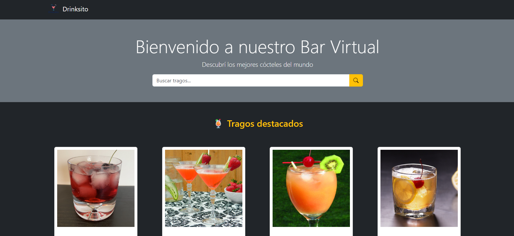
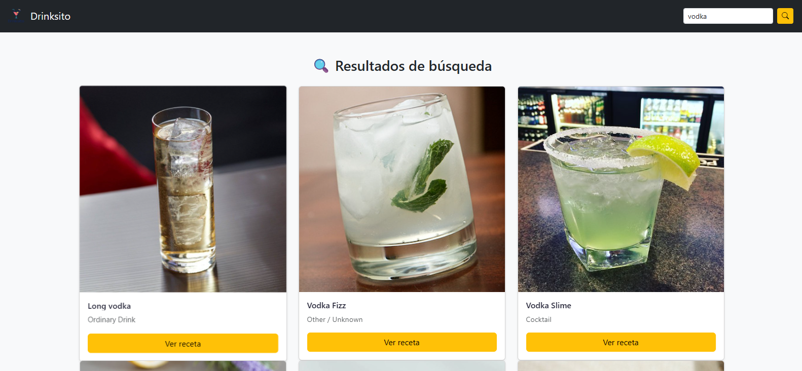

# 🥂 Drinksito

**Drinksito** es una aplicación web interactiva que permite buscar y explorar tragos y cócteles utilizando la API de [TheCocktailDB](https://www.thecocktaildb.com/). La app fue desarrollada como parte de un proyecto final integrador con HTML, CSS, JavaScript puro y librerías modernas como SweetAlert2, SwiperJS y Pagination.js.

---

## 🚀 Funcionalidades

- 🔍 Búsqueda interactiva de cócteles por nombre
- 📋 Vista de resultados paginada con diseño personalizado (Pagination.js)
- 🍹 Sección "Ver menú" para explorar todos los tragos por categoría, vaso o tipo de bebida
- 🛒 Carrito de cócteles persistente en localStorage
- 📄 Página de detalle con receta completa e ingredientes
- ⏳ Loader animado que se muestra al iniciar y al cambiar de página
- 🧠 Prellenado automático del campo de búsqueda
- 📱 Diseño responsive adaptado a dispositivos móviles
- 💅 Interfaz con estilo moderno usando Bootstrap 5 y diseño propio en CSS

---

## 📦 Tecnologías utilizadas

- HTML5 + CSS3 + JavaScript ES6
- Bootstrap 5
- SweetAlert2
- SwiperJS (para carrusel de tragos destacados)
- Pagination.js (para paginación en resultados y menú)
- TheCocktailDB API

---

## 🛠️ Instalación y uso

1. Cloná el repositorio:

```bash
git clone https://github.com/M1S43L10/Drinksito.git
cd drinksito
```

2. Abrí el archivo `index.html` en tu navegador.  
3. ¡Listo! Ya podés buscar cócteles, ver su detalle y agregarlos al carrito.

---

## 📁 Estructura del proyecto

```
📦 drinksito/
├── index.html                  # Página principal (Home)
├── assets/                     # Imágenes, logo y capturas
│   └── screenshots/            # Capturas para documentación
├── css/
│   └── style.css               # Estilos principales
├── js/
│   ├── api.js                  # Clase para consumir TheCocktailDB
│   ├── index.js                # Lógica de la página principal
│   ├── carrito.js              # Lógica del carrito
│   ├── mis-pedidos.js          # Lógica de mis-pedidos
│   ├── resultados.js           # Resultados con paginación
│   ├── menu.js                 # Página "Ver menú" con filtros
│   ├── detalle.js              # Página de detalle del trago
│   ├── loader.js               # Animación de carga
│   └── precios.js              # Simulador de precios con persistencia
└── pages/
    ├── resultados.html         # Página de resultados
    ├── detalle.html            # Página de detalle
    ├── mis-pedidos.html        # Página de mis-pedidos
    ├── carrito.html            # Página de carrito
    └── menu.html               # Página de carta/menú
```

---

## 📸 Capturas

### Pantalla principal



### Resultados de búsqueda



### Ver menú


---

## ❤️ Créditos

- API utilizada: [TheCocktailDB](https://www.thecocktaildb.com/)
- Icono creado con IA y adaptado para el branding de Drinksito
- Proyecto realizado por Misael M. Ramirez / @M1S43L10

---

## 📃 Licencia

Este proyecto es de uso educativo y libre para compartir.  
Si te gusta, ¡no olvides dejar una ⭐ en el repo!
